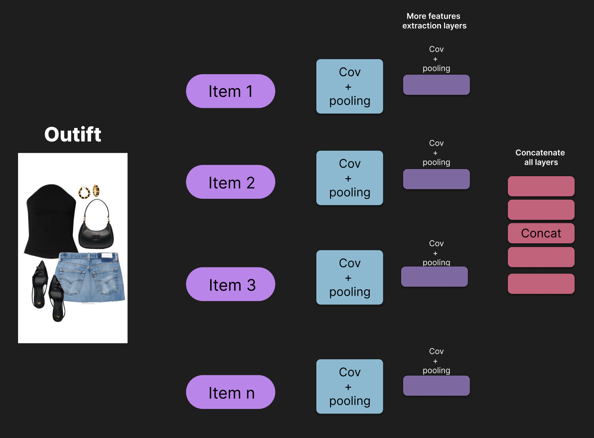
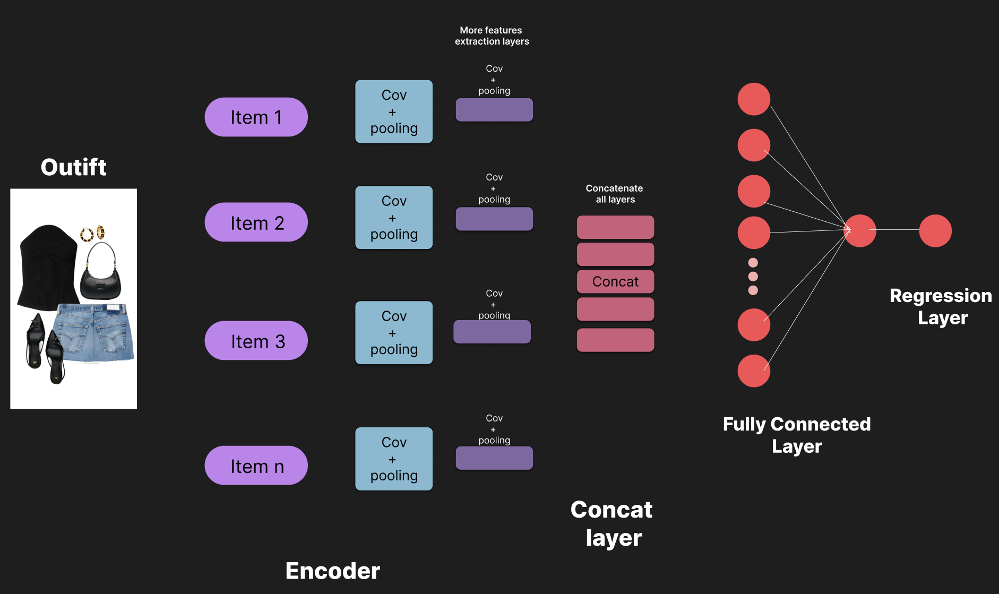
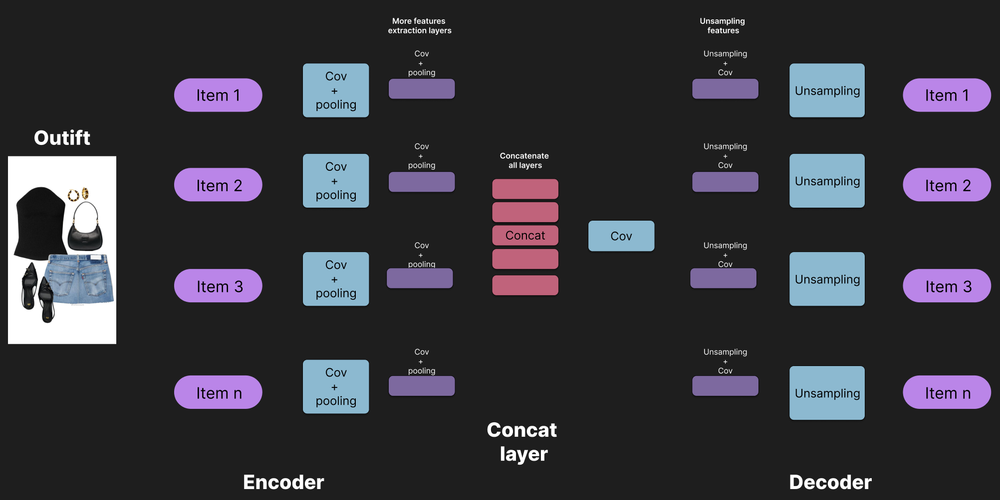

  <h1>Fashion style Recommender system</h1>

<h3>The objective: build an recommender sytem able to create recommendations of oufits with user's closet based on social network opinions</h3>

The dataset used has the following structure:

    'name': 'Street Dance',
    'views': 2334,
    'items': [{'index': 1,
            'name': 'dolce gabbana silk shirt',
            'price': 657.0,
            'likes': 347,
            'image': 'http://img2.polyvoreimg.com/cgi/img-thing?.out=jpg&size=m&tid=102972440',
            'categoryid': 17},
            ...] # More items
    'image': 'http://ak1.polyvoreimg.com/cgi/img-set/cid/214181831/id/El8a99fQ5hG4HrPFO4xqOQ/size/y.jpg',
    'likes': 394,
    'date': 'One month',
    'set_url': 'http://www.polyvore.com/casual/set?id=214181831',
    'set_id': '214181831',
    'desc': 'A fashion look from January 2017 by beebeely-look featuring Fuji, Citizens of Humanity

As we can see, the dataset provides different sets, or in others words, provides complete oufits divided in different categories, such as:

* 3 Dresses
* 4 Day Dresses
* 5 Cocktail Dresses
* 7 Skirts
* 8 Mini Skirts
* 9 Knee Length Skirts
* 10 Long Skirts
* 11 Tops
* And more...

These categories are identified with indixes, and we have data for men and women outfits. So basically, we can extract outfits for each genre.

<h3>Approach to solve the problem</h3>

The problem is prediction, so we have to find a way to made this prediction. In this case, we can transform this problem to regression problem. The key for this idea is keep in mind the dataset provede for each outfit an amount of likes. So, we can learn from the different outfits, each image, and then try to learn from the most important patterns in each outfit to predict the amount of likes.

In this way, the model will be able to create and recommend new outfits using the user's closet, and based on social network opinions. So, that outfit will receive the most amount of likes in social networks.

<h3>Defining an outfit</h3>

In this case, I am going to define an outfit, in terms to do more simple the problem:

**Men**

* Tshirt and Polos
* Pullover (optional)
* Shorts or pants or jeans 
* Shoes or sneakers 

**Women**
* Top
* Bottom
* Pullover (optional)
* Outerwear (optional)
* Shoes

---

<h2>Solution using a Convolutional Autoencoder</h2>

### The main workflow for model training
* Use the outfit descriptions to extract only the images that match articles of clothing in our definition of an "outfit."
* Train an autoencoder model for each type of clothing in our defined “outfit.”
* Predict embeddings for each input image.
* Train a multi-input CNN to predict the likes for each outfit.

In this case, the neuronal network used is an Convolutional neuronal network, the way that a CNN works is simple. The CNN receive an input, and then is from the input will be extracted the its features, the next step is create an flatten layer and finally made a regression. 

So, the problem was trasform from recommendation system to regression problem.

      +--------------------+     +--------------------------+     +---------------------+     +--------------------------+     +---------------------------+     +-----------------------+     +--------------------------+     +------------------+
      |    Input Image     | --> | Convolutional Layer      | --> | ReLU Activation      | --> | Pooling Layer           | --> | Repeat: Conv + ReLU + Pooling | --> | Flatten Layer         | --> | Fully Connected Layers | --> | Output Layer     |
      |                    |     | (Filters applied)        |     | (Non-linearity)       |     | (Dimension reduction)   |     | (as needed)              |     | (Convert to vector)  |     | (Classification)       |     | (Prediction)      |
      +--------------------+     +--------------------------+     +---------------------+     +--------------------------+     +---------------------------+     +-----------------------+     +--------------------------+     +------------------+

Image: provided by [Convolutional Neural Networks cheatsheet](https://stanford.edu/~shervine/teaching/cs-230/cheatsheet-convolutional-neural-networks)

The convolutions and pooling layers are named as feature extraction. In this case is important to keep in mind the convolutions create a layer called feature map, and then using a pooling layer is possible to extract the most important data from the feature map, reducing the size of the input image. 

But, in this case we have a multiple input, an oufit contains more than one item. The way to solve this is thinking the following approach.

Basically we can process each image with feature extraction, and then concantenate the all images in a reduced layer. So this approach fits perfectly with the architecture of an autoencoder. This first part is called encoder.

So, using the concatenate layer is possible to train the CNN using the whole outfit and finally get the prediction of the amount of likes, using regression.

Also, we need a way to decode this layer, and that part is the second part of autoencoders, called decoder.

Finally we have the architecture complete for autoencoder.

The project will be implemented using keras of tensorflow.

